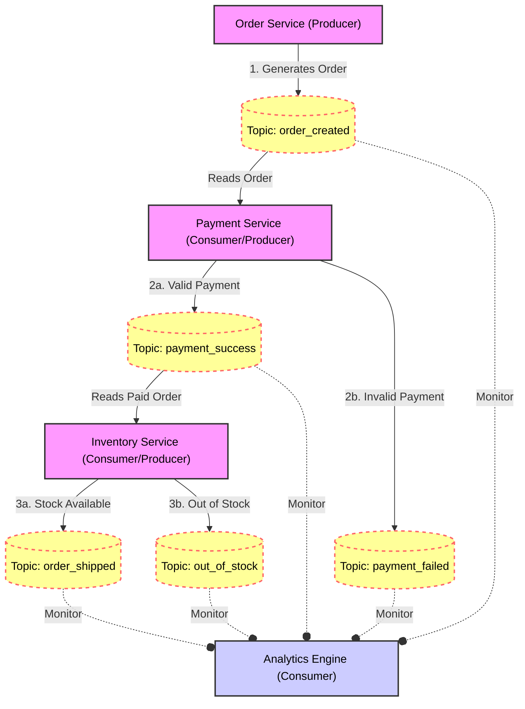

# Kafka-Orchestration-Practice

```mermaid
sequenceDiagram
    participant User
    participant Orchestrator
    participant PaymentSvc
    participant InventorySvc

    User->>Orchestrator: Start Order (ORD-123)
    
    Note over Orchestrator: State: PENDING_PAYMENT
    Orchestrator->>PaymentSvc: CMD: CHARGE_CARD
    
    PaymentSvc-->>Orchestrator: REPLY: SUCCESS
    
    Note over Orchestrator: State: PENDING_INVENTORY
    Orchestrator->>InventorySvc: CMD: SHIP_ITEMS
    
    InventorySvc-->>Orchestrator: REPLY: SUCCESS
    
    Note over Orchestrator: State: COMPLETED
